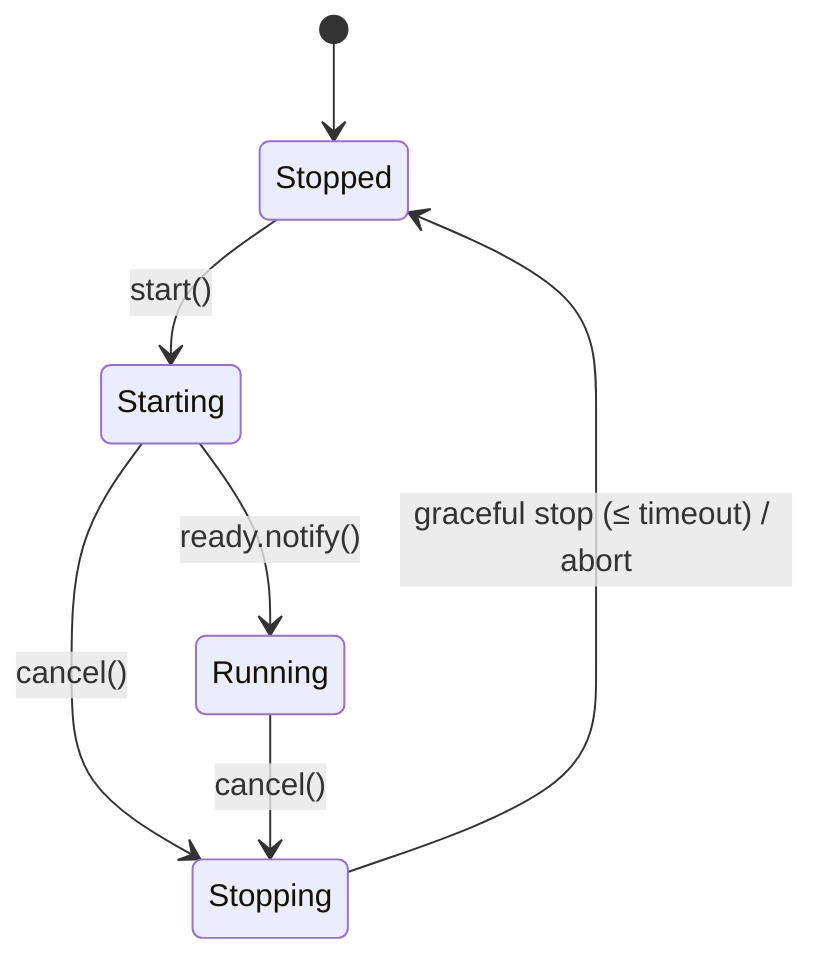
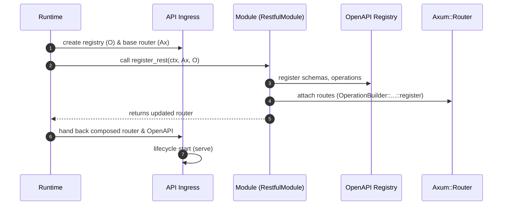

# API Ingress Module

The **API Ingress** module (`api_ingress`) is the single HTTP gateway of your app. It owns the Axum server and OpenAPI document, gathers REST routes from all modules at the **REST registration phase**, and serves them during **lifecycle start**.
This README reflects the *current, in-process* design (no out-of-process/proxy modules here).

---

## 🌟 What API Ingress does

* **Single HTTP surface** — one Axum `Router` for the whole app.
* **Type-safe registration** — modules add endpoints via `OperationBuilder`.
* **OpenAPI assembly** — collects schemas & operations into a single spec.
* **Docs UI** — `/docs` served by Stoplight Elements (CDN by default; `--features embed_elements` to bundle).
* **Platform layers** — CORS, request limits, timeouts, tracing, health.
* **Lifecycle** — runs the HTTP server as a stateful service with graceful shutdown and readiness gating.

---

## 🏗 Architecture

```mermaid
graph TB
  subgraph "External"
    Browser[Web Browser]
    API[API Clients]
    Curl[curl/Postman]
  end

  subgraph "API Ingress"
    Router[Axum Router]
    OpenAPI[OpenAPI Builder]
    Docs[Docs (/docs)]
    Registry[OpenAPI Registry]
    Components[Schema Components]
  end

  subgraph "Modules"
    M1[Custom Module 1]
    M2[Custom Module 2]
    MN[More Modules…]
  end

  subgraph "ModKit Runtime"
    Runner[Runtime Runner]
    Ctx[ModuleCtx]
  end

  Browser --> Router
  API --> Router
  Curl --> Router

  Router --> Docs
  Router --> OpenAPI
  OpenAPI --> Components

  M1 --> Registry
  M2 --> Registry
  MN --> Registry

  Registry --> Router
  Components --> OpenAPI
  Runner --> Registry
  Ctx --> Registry
```

---

## 🔁 Runtime lifecycle (ingress server)

API Ingress runs as a stateful service with readiness gating.



* **Starting → Running** happens only after the server successfully binds and calls `ready.notify()`.
* On shutdown, `cancel` triggers Axum graceful drain; if it doesn’t finish within `stop_timeout`, it’s aborted.

---

## 🧩 How modules register routes (type-safe)

Each module implements `RestfulModule` and uses `OperationBuilder`:

```rust
pub trait RestfulModule: Send + Sync {
    fn register_rest(
        &self,
        ctx: &crate::context::ModuleCtx,
        router: axum::Router,
        openapi: &mut dyn crate::api::OpenApiRegistry,
    ) -> anyhow::Result<axum::Router>;
}
```

Example:

```rust
use modkit::api::OperationBuilder;
use schemars::schema_for;
use axum::routing::{get, post};
use axum::Router;

impl RestfulModule for MyModule {
    fn register_rest(
        &self,
        _ctx: &ModuleCtx,
        router: Router,
        openapi: &mut dyn crate::api::OpenApiRegistry,
    ) -> anyhow::Result<Router> {
        openapi.register_schema("Resource", schema_for!(dto::Resource));

        let router = OperationBuilder::get("/resources/{id}")
            .operation_id("resources.get")
            .summary("Get resource")
            .path_param("id", "Resource id")
            .json_response(200, "OK")
            .json_response(404, "Not found")
            .handler(get(handlers::get_resource))
            .register(router, openapi);

        let router = OperationBuilder::post("/resources")
            .operation_id("resources.create")
            .summary("Create resource")
            .json_response(201, "Created")
            .json_response(400, "Invalid input")
            .handler(post(handlers::create_resource))
            .register(router, openapi);

        Ok(router)
    }
}
```

**Builder guarantees:** `register()` only exists once a handler and at least one response are set.

### Registration flow (sequence)



---

## 🧰 ModuleCtx (as used today)

```rust
pub trait ConfigProvider: Send + Sync {
    /// Returns raw JSON section for the module, if any.
    fn get_module_config(&self, module_name: &str) -> Option<&serde_json::Value>;
}

#[derive(Clone)]
pub struct ModuleCtx {
    pub(crate) db: Option<std::sync::Arc<modkit::db::DbHandle>>,
    pub(crate) config_provider: Option<std::sync::Arc<dyn ConfigProvider>>,
    pub(crate) client_hub: std::sync::Arc<modkit::client_hub::ClientHub>,
    pub(crate) cancellation_token: tokio_util::sync::CancellationToken,
    pub(crate) module_name: Option<std::sync::Arc<str>>,
}
```

Common patterns:

```rust
// Raw config section:
if let (Some(name), Some(cp)) = (ctx.module_name.as_deref(), ctx.config_provider.as_ref()) {
    if let Some(raw) = cp.get_module_config(&name) {
        let cfg: MyConfig = serde_json::from_value(raw.clone())?;
    }
}

// DB access (SeaORM/SQLx via DbHandle):
if let Some(db) = &ctx.db { /* … */ }

// Typed clients via ClientHub:
let hub = &ctx.client_hub; /* resolve published clients as your app defines */
```

---

## 🧱 Declaring the ingress module (macro + lifecycle)

`api_ingress` uses the attribute macro to declare capabilities and lifecycle:

```rust
#[modkit::module(
    name = "api_ingress",
    deps = [],                         // ingress depends on nothing by default
    caps = [rest_host, rest, stateful],// hosts HTTP, has its own REST, runs server
    lifecycle(entry = "serve",         // async entry method
              stop_timeout = "30s",    // graceful stop deadline
              await_ready)             // Running only after `ready.notify()`
)]
#[derive(Clone, Default)]
pub struct ApiIngress { /* fields… */ }

impl ApiIngress {
    pub async fn serve(
        self: std::sync::Arc<Self>,
        cancel: tokio_util::sync::CancellationToken,
        ready: modkit::lifecycle::ReadySignal,
    ) -> anyhow::Result<()> {
        // 1) take finalized router or build fallback
        // 2) bind TcpListener
        // 3) ready.notify()
        // 4) axum::serve(...).with_graceful_shutdown(cancel.cancelled())
        Ok(())
    }
}
```

**Capabilities**

* `rest_host` — owns the HTTP listener/server and platform layers.
* `rest` — exposes its own endpoints (`/health`, `/docs`, `/openapi.json`).
* `stateful` — long-running server; the macro wires `Runnable` + `WithLifecycle<T>` when `lifecycle(...)` is present.
  If you list `stateful` *without* `lifecycle(...)`, implement `StatefulModule` yourself.

---

## ⚙️ Configuration

```rust
use serde::{Deserialize, Serialize};

#[derive(Debug, Clone, Serialize, Deserialize)]
pub struct ApiIngressConfig {
    /// Address to bind HTTP server (e.g., "127.0.0.1:8087")
    pub bind_addr: String,
    /// Enable API documentation at /docs (Stoplight Elements)
    pub enable_docs: bool,
    /// Enable CORS middleware
    pub cors_enabled: bool,
    /// Request timeout in seconds
    pub request_timeout_secs: u64,
    /// Maximum request size in megabytes
    pub max_request_size_mb: usize,
}

impl Default for ApiIngressConfig {
    fn default() -> Self {
        Self {
            bind_addr: "127.0.0.1:8087".to_string(),
            enable_docs: true,
            cors_enabled: false,
            request_timeout_secs: 30,
            max_request_size_mb: 16,
        }
    }
}
```

YAML:

```yaml
modules:
  api_ingress:
    bind_addr: "127.0.0.1:8087"
    enable_docs: true
    cors_enabled: false
    request_timeout_secs: 30
    max_request_size_mb: 16
```

Env overrides (illustrative):

```bash
export HYPERSPOT_MODULES_API_INGRESS_BIND_ADDR="0.0.0.0:8080"
export HYPERSPOT_MODULES_API_INGRESS_ENABLE_DOCS="false"
export HYPERSPOT_MODULES_API_INGRESS_CORS_ENABLED="true"
```

---

## 📚 OpenAPI endpoints

* `GET /openapi.json` — generated OpenAPI 3.0 spec.
* `GET /docs` — interactive documentation (Stoplight Elements).
* `GET /health` — liveness/readiness probe.

---

## 🧪 Testing

### Route unit tests (module side)

```rust
#[tokio::test]
async fn test_rest_endpoints() {
    use axum::{body::Body, http::Request, http::StatusCode};
    use tower::ServiceExt;

    let module = MyModule::default();
    let ctx = test_ctx(); // your helper
    let mut oas = modkit::api::testing::MockOpenApiRegistry::new();
    let app = module.register_rest(&ctx, axum::Router::new(), &mut oas).unwrap();

    let resp = app
        .clone()
        .oneshot(Request::builder().uri("/resources/1").body(Body::empty()).unwrap())
        .await
        .unwrap();
    assert_eq!(resp.status(), StatusCode::OK);
}
```

### Ingress integration test

Start the runtime with ingress, perform real HTTP calls to module routes, and assert `/openapi.json` content.

---

## ⚡ Performance & robustness

* **Lock-free hot path** — composed router stored via `Arc`/`ArcSwap`; no global `RwLock` on request.
* **Minimal overhead** — type-safe registration happens once in REST phase; handlers are plain Axum.
* **Graceful shutdown** — lifecycle cancellation drives Axum graceful stop; hard abort after `stop_timeout`.

---

## ✅ Best practices

* Keep handlers thin; call your domain services directly.
* Register all request/response models with `OpenApiRegistry`.
* Use clear `operation_id` (e.g., `"module.action"`).
* Favor sensible defaults; expose knobs via module config.
* Use `tracing` with module/operation/status fields.

---

This README re-adds the diagrams and documents the **current** in-process API Ingress: one HTTP server, modules register via `OperationBuilder`, ingress hosts docs & health, and lifecycle is orchestrated via macro-generated `Runnable`/`WithLifecycle` with readiness gating.
